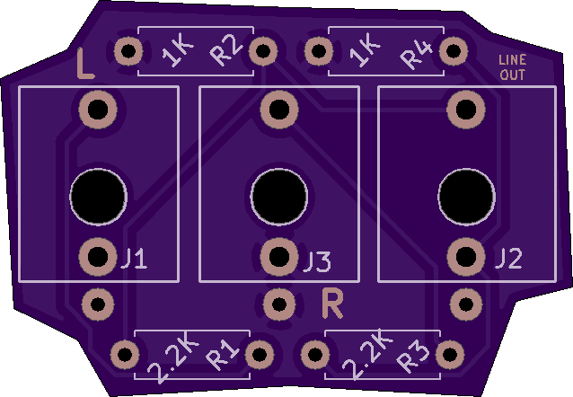
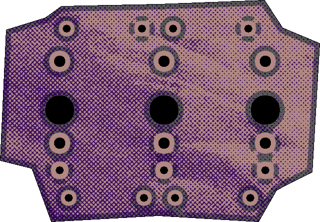

# 0hp-modular-lineout
a 0hp widget for eurorack modular to line level conversion (voltage divider)

 

+ 2x [thonkiconn mono jacks](https://www.thonk.co.uk/shop/3-5mm-jacks/)
+ 1x [thonkiconn stereo jack](https://www.thonk.co.uk/shop/3-5mm-jacks/)
+ 2x 1K resistors
+ 2x 2.2K resistors

---
REV1     
Build and use at your own risk! I am not responsible for any damage to self or otherwise that arises from using this project!

[CC BY-SA-NC 4.0](https://creativecommons.org/licenses/by-nc-sa/4.0/)     
If you'd like to sell this, contact me.
